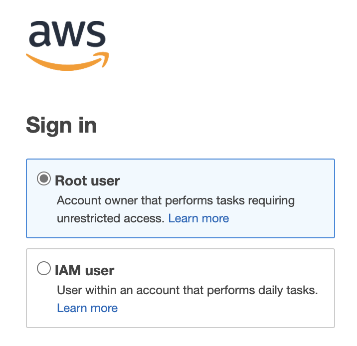
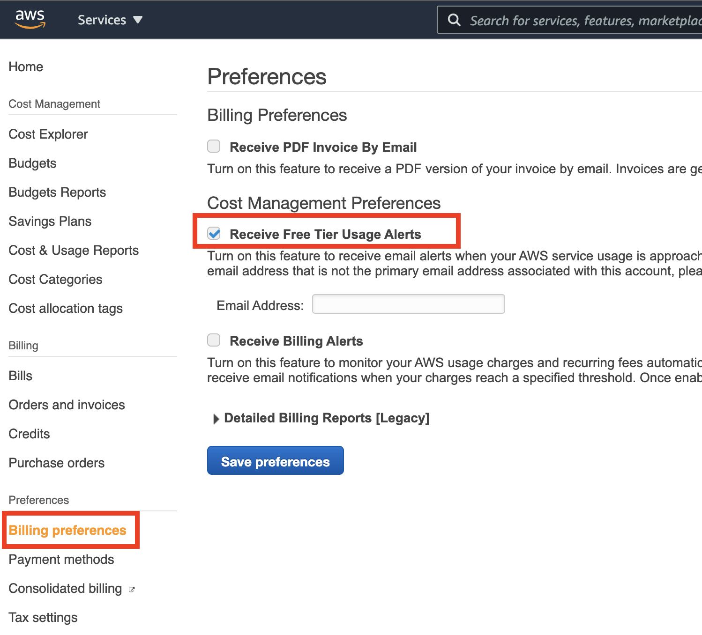
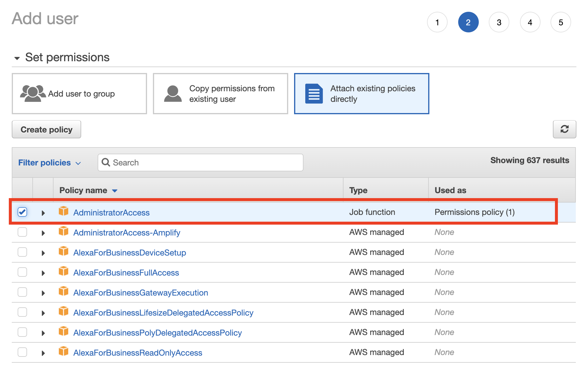
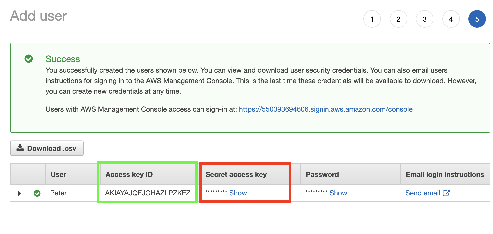

# AWS - Very First Steps

## Create Amazon account.

This account is the *Root user*. You need an email address, telephone number, credit card. MFA is optional but highly recommended (e.g. Google authenticator).

Tipp: Keep the Root user account separate from your others Amazon account(s).

[Start here.](https://portal.aws.amazon.com/billing/signup#/start)


## Explore the  Management Console.

[https://console.aws.amazon.com/](https://console.aws.amazon.com/)

That's the GUI. Sign in as the Root user.




## Configure Free Tier Usage Alerts

In Management Console search for *Billing*.




## Create IAM user for daily use

In Management Console search for *IAM*.

Add user: Enable both *Programmatic access* as well as *AWS Management Console access*.

Set permissions: Attach existing policies directly (AdministratorAccess)



Copy IAM user's access key and access key ID for later use.




## Install AWS CLI locally

[Start here.](https://aws.amazon.com/cli/)

Test the installation. Enter IAM user's access key and access key ID. This creates `~/.aws/credentials`

```bash
aws --version

aws configure
cat ~/.aws/credentials
cat ~/.aws/config

aws iam list-users
```


## Install Terraform locally

 [Start here.](https://learn.hashicorp.com/tutorials/terraform/install-cli)

 Try the docker example, either with your local Docker installation or on [Katacoda](https://www.katacoda.com/courses/terraform/deploy-nginx).

```bash
terraform version
terraform init
terraform apply
terraform destroy
 ```
Tipp: If you use VS Code try [Hashicorp's Terraform extension](https://marketplace.visualstudio.com/items?itemName=HashiCorp.terraform).

<br>
<br>
<br>

***

## Demo 1 - Terraform Docker
```bash
terraform {
  required_providers {
    docker = {
      source = "kreuzwerker/docker"
    }
  }
}

provider "docker" {}

resource "docker_image" "nginx" {
  name         = "nginx:latest"
  keep_locally = false
}

resource "docker_container" "nginx" {
  image = docker_image.nginx.latest
  name  = "demodocker"
  ports {
    internal = 80
    external = 8000
  }
}
```

```bash
terraform init
terraform apply

docker images
docker ps

terraform destroy
```


<br>
<br>
<br>

***

## Demo 2 - Terraform EC2

At Management Console look for an appropriate AMI (AMI = AWS Machine Image, comparable to Azure VM size).

Example: `ami-0bd39c806c2335b95`

```bash
aws ec2 describe-instances
aws ec2 describe-key-pairs
```

### Side Note: SSH fingerprints in AWS
```bash
# The way AWS calculates the fingerprint depends on the way the key was created:

#   a) Key generated on AWS
#   -----------------------
#   Simple case. AWS shows the SHA1 fingerprint of the key

sshkey1=~/.ssh/aws-training.pem    # key generated on AWS
openssl pkcs8 -in $sshkey1 -nocrypt -topk8 -outform DER | openssl sha1 -c

#    b) Key uploaded to AWS
#    ----------------------
#    More complicated. AWS treats the key as SSH2 and shows the MD5 fingerprint

sshkey2=~/.ssh/id_rsa              # key uploaded to AWS
openssl pkey -in $sshkey2 -pubout -outform DER | openssl md5 -c

#    This is different to the MD5 fingerprint of public key treated as openSSH key
ssh-keygen -E md5 -lf $sshkey2
#    So don't be confused.

```

Now the demo:
```bash
terraform {
  required_providers {
    aws = {
      source  = "hashicorp/aws"
      version = "~> 2.70"
    }
  }
}

provider "aws" {
  profile = "default"
  region  = "eu-central-1"
}

resource "aws_instance" "demo" {
  ami           = "ami-0bd39c806c2335b95"
  instance_type = "t2.micro"
  key_name = "tj@foo.local"
}
```

```bash
terraform init
terraform apply

aws ec2 describe-instances --query "Reservations[*].Instances[*].{InstanceType:InstanceType,ImageId:ImageId,KeyName:KeyName,State:State.Name}" --output table

ip=$(aws ec2 describe-instances --query "Reservations[0].Instances[0].PublicIpAddress" --output text)

ssh -i $sshkey_awstraining ec2-user@$ip_awstraining
ssh -i $sshkey_tj          ec2-user@$ip_tj

terraform destroy
```
